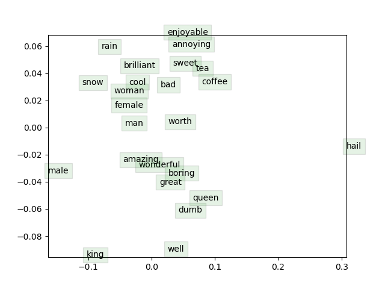

# Implementation of Skip Gram Word2Vec Model

The key insight behind word2vec is that ‘a word is known by the company it keeps’. Concretely, consider a ‘center’ word c surrounded before and after by a context of a certain length. We term words in this contextual window ‘outside words’ (O). For example, in Figure 1, the context window length is 2, the
center word c is ‘banking’, and the outside words are ‘turning’, ‘into’, ‘crises’, and ‘as’:


Skip-gram word2vec aims to learn the probability distribution P (O|C). Specifically, given a specific word o and a specific word c, we want to predict P (O = o|C = c): the probability that word o is an ‘outside’ word for c (i.e., that it falls within the contextual window of c)

In this project, we implemented Skip Gram Word2Vec Model with Naive Softmax and Negative Sampling Loss functions

## Setup

The Code is written in Python 3.12.2 . If you don't have Python installed you can find it [here](https://www.python.org/downloads/). If you are using a lower version of Python you can upgrade using the pip package, ensuring you have the latest version of pip

```
conda env create -f env.yml
conda activate a2
```

## Dataset

For this experiment we used `Stanford Sentiment Treebank V1.0` dataset.

To download the dataset:

`sh get datasets.sh`

Details about the dataset:
1. `original_rt_snippets.txt` contains 10,605 processed snippets from the original pool of Rotten Tomatoes HTML files. Please note that some snippet may contain multiple sentences.

2. `dictionary.txt` contains all phrases and their IDs, separated by a vertical line |

3. `sentiment_labels.txt` contains all phrase ids and the corresponding sentiment labels, separated by a vertical line. Note that you can recover the 5 classes by mapping the positivity probability using the following cut-offs: [0, 0.2], (0.2, 0.4], (0.4, 0.6], (0.6, 0.8], (0.8, 1.0] for very negative, negative, neutral, positive, very positive, respectively.

    Please note that phrase ids and sentence ids are not the same.

4. `SOStr.txt` and `STree.txt` encode the structure of the parse trees. STree encodes the trees in a parent pointer format. Each line corresponds to each sentence in the datasetSentences.txt file. The Matlab code of this paper will show you how to read this format if you are not familiar with it.

5. `datasetSentences.txt` contains the sentence index, followed by the sentence string separated by a tab. These are the sentences of the train/dev/test sets.

6. `datasetSplit.txt` contains the sentence index (corresponding to the index in datasetSentences.txt file) followed by the set label separated by a comma:
	1 = train
	2 = test
	3 = dev
    
For this experiment we use `datasetSentences.txt`

## Usage

1. Clone the repository

    `git clone https://github.com/shasha3493/Skip-Gram-Word2Vec.git`
  
2. Change to the working directory

    `cd Skip-Gram-Word2Vec`
    
3. To train the model 
    
    `python run.py`

## Results

### 1. Visualization of word vectors

Here's the visualization of word vectors trained with Skip Gram model with Negative Sampling Loss 



Since the dimensionality of word vectors has been reduced from 10 to 2 for visualization purpose, there is a loss of information resulting in similar words not being close to eacj other. However, we see that some words exhibit rational clusters that seem to align with our intuitive understanding. For example, we see the presence of cluster depicting emotions like amazing, wonderful, boring, great. 

Also, the stark contrast between the vectors of king and queen, both distant from one another and the cluster of woman, female, and man, highlights the complexity of gendered language and the ways in which social and cultural factors can influence our understanding of certain words.

#### 2. Training Efficiency

In this experiment we trained the skip gram model both with naive softmax and negative sampling loss function. We see that training time (total epochs = 40000) for softmax is 14059 sec and negative sampling is 9412 sec on the same machine which is almost 1.5 times less. The negative sampling loss function is more efficient than the naive-softmax loss because it replaces the computation of the softmax function over the entire vocabulary with a smaller computation over a small number of negative samples, resulting in faster training and lower computational cost.  


#### 3. Word Analogies

We also see word analogies like:

`king - male + female = queen`

